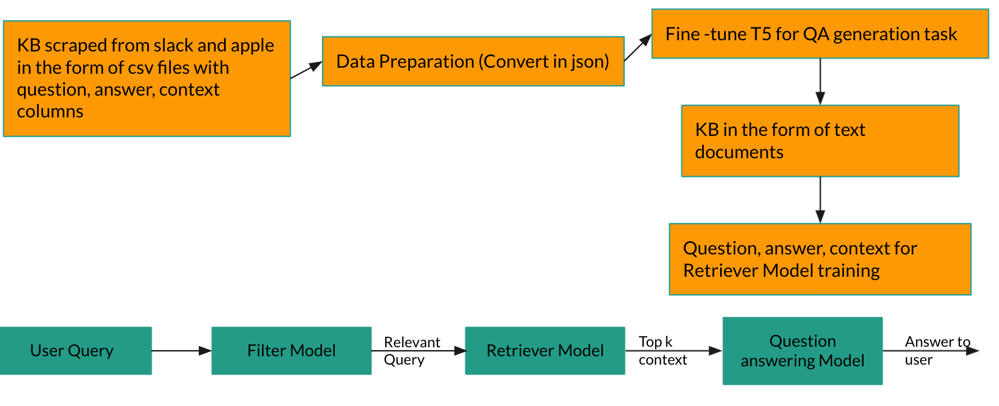

# Knowledge Retrieval Framework using T5 and Bert

This github has all the pieces for creating a QA bot from support websites of a company. It is using slack and apple as an example. 

## Pipeline
  
  
## Model Components

### Scraper (KB generation)
Code for scraping is in scraping folder. scraping_bs.py was used for scraping slack tips in csv with columns: question, answer,context, answer_start.
This csv was then fed to T5 for finetuning after pre-processing (Explained in T5 section). 
Apple support site scraping was done through parse hub and scrapy crawler. Data was directly loaded in s3. This piece is not included in github.

### Filter Model
This model first splits the input queries in sentences and then each sentence is classified as relevant/irrelevant. Only relevant portion of the query is passed
along.
Code is under Filter_Model/filter.py. This file can just be run as standalone python filter.py and it asks for an input query and will respond back with only 
relevant portion

### T5
This portion has been taken from this github :- https://github.com/patil-suraj/question_generation
Scraped slack data was pre-processed and used for finetuning. And then QA task was used to generate question answer pairs.

### Retriever/Reader Model
The retriever model is responsible for finding the best documents to answer a given question.
Every document is converted into an embedding, and every question is also converted to embedding using a separate model of the same architecture.
When the question is converted into an embedding, the k product similarity gives back the key most similar contexts.

The reader model, on the other hand, is A simple BERT-like model configured for question answering tasks.
The documents returned by the retriever model constitute the context for the reader model.
The reader model then tries to find the snippet of this context that best answers the question.

## Usage

For now, the reader model can be trained with the `train.py` script.
By default, it trains on the Slack deal with script from the web.

To run inference on the model in AWS, see the `awsdeployment/deployment.ipynb` notebook.
The files in AWS deployment need also to be uploaded to the directory of the SageMaker notebook.

We will except command line arguments soon.